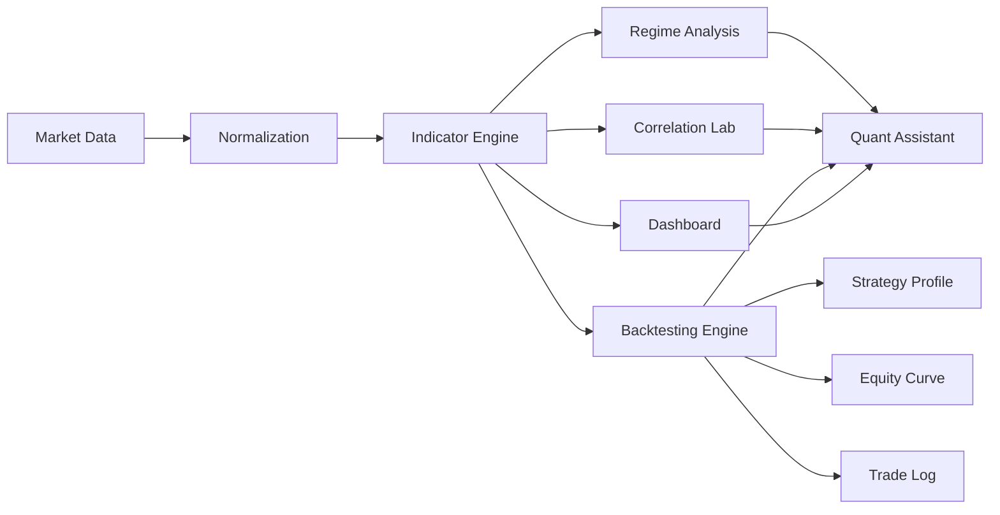
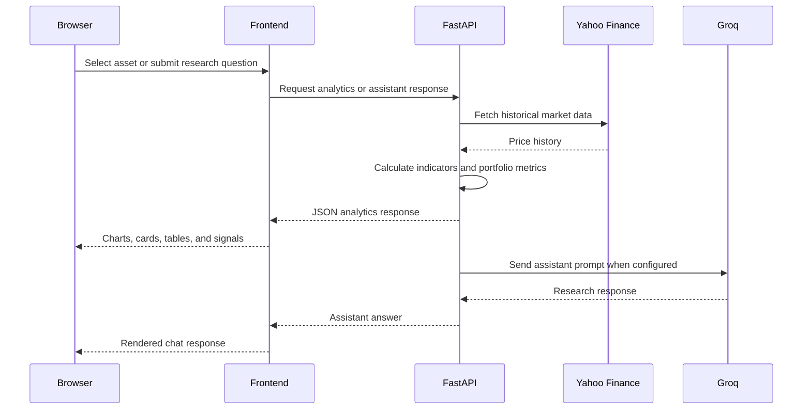

# Fin4X,Finsights tailored just for you

## Quantitative Multi-Asset Financial Intelligence and Backtesting Platform

Fin4X turns market history into a focused research workspace for comparing assets, measuring risk, studying changing relationships, and testing quantitative strategies.

The platform combines financial data engineering, statistical indicators, portfolio simulation, interactive visualization, market-regime analysis, and a prototype AI research assistant in one browser-based application.

> Built for research and demonstration purpose. Historical analysis and simulated backtests do not guarantee future performance.

## What Makes Fin4X Useful

- Compare Gold, Bitcoin, and NVIDIA in one workspace.
- Move from raw prices to trend, return, volatility, Sharpe ratio, and drawdown analysis.
- Explore both static and rolling cross-asset correlations.
- Test four predefined strategies with capital, position sizing, transaction costs, periods, and benchmark comparison.
- Inspect regime behavior across bull, bear, high-volatility, and low-volatility conditions.
- Run Monte Carlo forecasts, portfolio allocation experiments, VaR/CVaR analysis, ML regime clustering, and paper trades.
- Ask the Fin4X Quant Research Assistant for research-oriented explanations.

## Interactive Research Flow



## Main Workspace

### Overview

A multi-asset market tape with current prices, daily performance, Sharpe context, and normalized comparison charts.

### Asset Explorer

Select an asset and period to inspect:

- SMA50, EMA50, and EMA200
- Daily and cumulative return
- 21-day rolling return
- Annualized volatility
- Sharpe ratio and maximum drawdown
- Trend signal stack

### Correlation Lab

- Correlation matrix for all tracked assets
- Rolling 60-trading-day pair correlations
- Responsive chart layout with readable heatmap labels

### Strategy Lab

Run and compare:

- SMA Crossover
- EMA Trend
- Momentum
- Mean Reversion

Controls include:

- Asset
- Backtest period
- Initial capital
- Position sizing
- Fast and slow windows
- Transaction friction cost

Results include:

- Strategy and buy-and-hold equity curves
- Strategy and benchmark returns
- Sharpe ratios
- Annualized volatility
- Maximum drawdown
- Win rate
- Buy and sell markers
- Trade execution log
- Strategy Signal Quality radar profile
- Return, rolling volatility, and drawdown profile

### Market Regimes

The regime engine classifies history using trend direction and volatility state. The view includes a timeline, regime breakdown, and strategy comparison under selected market conditions.

### Advanced Lab

Advanced panels are grouped into one workspace:

- Monte Carlo Future Simulation
- Portfolio Weight Optimizer
- Value at Risk and Expected Shortfall
- ML Market Regime Clustering
- Paper Trading Simulator

### Quant Research Assistant

The bottom-right assistant prototype supports:

- Suggested prompts
- Custom questions
- Conversation history during the session
- Safe Markdown rendering for headings, bullets, code, and tables
- Groq-backed responses through the FastAPI backend

## Architecture



## Project Structure

```text
Stock4Cast/
├── backend/
│   ├── assistant_config.py  # Groq key placeholder and model
│   ├── backtester.py        # Portfolio simulation and strategy metrics
│   ├── engine.py            # Data fetching and quantitative indicators
│   └── main.py              # FastAPI routes and static frontend hosting
├── frontend/
│   ├── app.js               # Views, charts, interactions, assistant UI
│   ├── index.html            # Dashboard shell
│   └── styles.css           # Responsive presentation theme
├── requirements.txt
└── render.yaml
```

## Run Locally

From the project root:

```bat
cd C:\Users\bishw\Desktop\deployedsns\Stock4Cast
.venv\Scripts\activate
uvicorn backend.main:app --reload
```

Open:

```text
http://127.0.0.1:8000
```

If the virtual environment has not been created yet:

```bat
python -m venv .venv
.venv\Scripts\activate
pip install -r requirements.txt
uvicorn backend.main:app --reload
```

Do not run `uvicorn backend.main:app` from inside the `backend` directory. Run it from the `Stock4Cast` project root.

## Groq Assistant Setup

The assistant backend is configured in `backend/assistant_config.py`:

```python
GROQ_API_KEY = "PASTE_YOUR_GROQ_API_KEY_HERE"
GROQ_MODEL = "openai/gpt-oss-20b"
```

Replace the placeholder locally with your own Groq key. Never place a real key in `frontend/app.js`, commit it to Git, or paste it into a public repository. Rotate any key that has been exposed.

The assistant endpoint is:

```text
POST /api/assistant
```

The frontend sends the question and recent conversation history to the backend. The backend calls Groq and returns the answer to the browser.

## API Highlights

| Method | Endpoint | Purpose |
| --- | --- | --- |
| GET | `/api/health` | Service health check |
| GET | `/api/assets` | Overview asset payloads |
| GET | `/api/assets/{asset}` | Asset history and indicators |
| POST | `/api/backtest` | Run a strategy backtest |
| GET | `/api/correlation` | Static and rolling correlations |
| GET | `/api/regimes/{asset}` | Historical regime classification |
| GET | `/api/regime-performance/{asset}` | Strategy comparison by regime |
| GET | `/api/stress/{asset}` | Stress scenario simulation |
| GET | `/api/advanced/forecast/{asset}` | Monte Carlo forecast |
| GET | `/api/advanced/optimizer` | Portfolio weight search |
| GET | `/api/advanced/risk` | VaR and CVaR distribution |
| GET | `/api/advanced/ml-regimes` | Feature-based regime clustering |
| GET | `/api/advanced/paper` | Paper portfolio state |
| POST | `/api/advanced/paper/order` | Execute a simulated order |
| POST | `/api/assistant` | Groq-backed research assistant |

## Deployment on Render

The repository includes `render.yaml` with the following service behavior:

```yaml
buildCommand: pip install -r requirements.txt
startCommand: uvicorn backend.main:app --host 0.0.0.0 --port $PORT
healthCheckPath: /api/health
```

For a deployed assistant, configure the Groq key as a Render environment secret rather than committing it to `backend/assistant_config.py`. The app is intentionally usable without Groq; the assistant is the only feature that requires the external AI provider.

## Research Guardrails

Fin4X is intended for historical analysis and education. The backtesting engine uses shifted signals to reduce look-ahead bias and includes transaction costs, position sizing, benchmark comparison, and drawdown reporting. Results can still be affected by data quality, parameter selection, slippage assumptions, and overfitting.

## Future Extensions

- Provider-agnostic model configuration
- Live streaming market data
- Slippage and bid/ask simulation
- Persistent research workspaces
- Exportable reports
- Portfolio constraints and rebalancing schedules
- AI-generated research summaries grounded in current dashboard metrics

## License

This project is intended for research and demonstration use.
